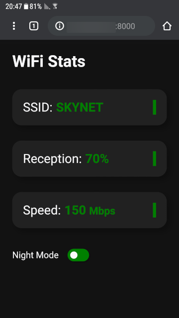
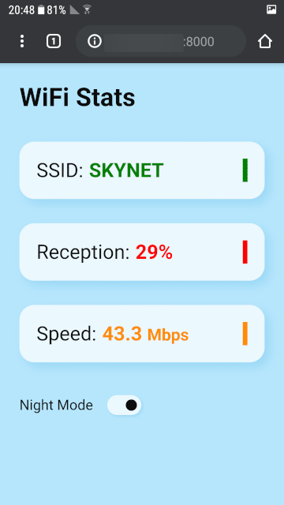

# Wifi-stats
View realtime wifi-stats of a Windows computer on other devices.

## About
This small application allows the user to see how good the computer's WiFi reception when placing a router, access point or repeater.
The stats are refreshed every second to help the user place the hardware in the most optimized place for having the best possible reception.
Stats can be viewed in the browser of every device connected to the same network.

## Usage
### Prerequisites
* Any portable device that is capable to connect to the same wireless network as the inspected computer, and has a browser application.
* On inspected computer:
  - Windows 7+
  - Python 3
  - Install the Flask package:
```
pip install flask
```
   

### How to use?
1. Run the "start.py" python file on the computer you wish to inspect, then press **\<ENTER\>**.
2. Open the portable device's browser and log into the address given on Step 1.
3. Move the router/AP/repeater around and see the computer's WiFi reception changed in real-time.

 &nbsp; 
